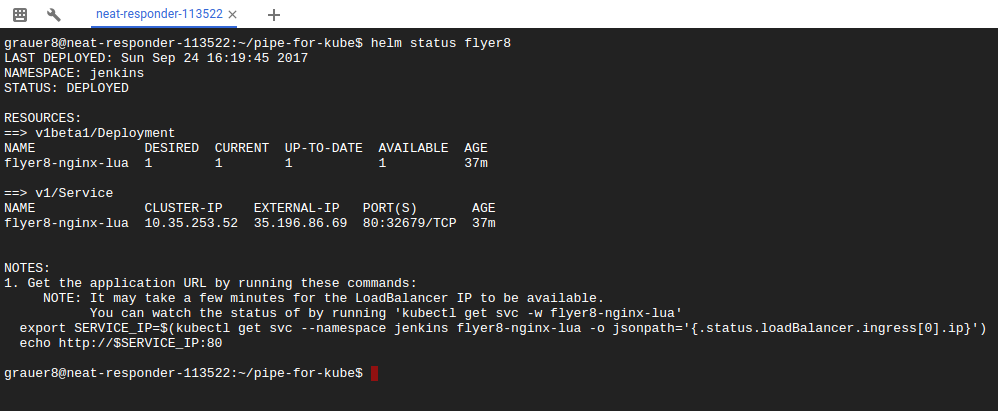
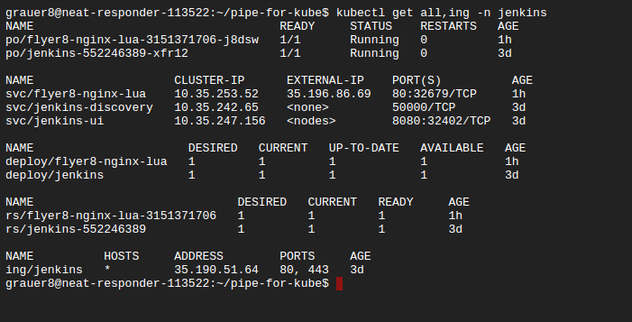

## Usage Jenkinsfile (groovy pipeline) for deploying webapp (nginx server) in Kubernetes using Helm package manager

Jenkins has been deployed in GCE Kubernetes cluster according to https://github.com/GoogleCloudPlatform/continuous-deployment-on-kubernetes

For Helm deploying, Docker image https://hub.docker.com/r/guigo2k/jenkins-k8s-slave/ is used for dynamical Jenkins slave nodes.
It intended to be used as a replacement for image **gcr.io/cloud-solutions-images/jenkins-k8s-slave** in continuous-deployment-on-kubernetes.

Docker image of Nginx-lua server.
https://hub.docker.com/r/flyer8/nginx-lua/

